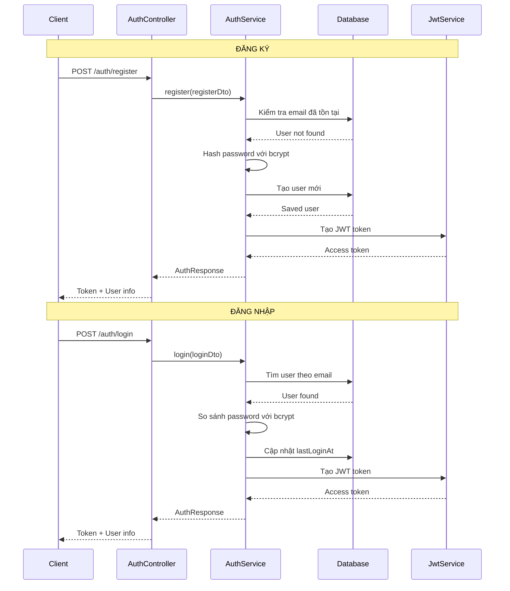

# 🔐 Hệ thống Authentication - Charity Backend

## 🎯 Tổng quan

Hệ thống xác thực của Charity Backend sử dụng **JWT (JSON Web Tokens)** kết hợp với **bcrypt** để mã hóa mật khẩu. Hệ thống hỗ trợ đăng ký và đăng nhập bằng email, với khả năng bảo vệ các routes bằng JWT Guard.

## 🏗️ Kiến trúc Authentication

### 📁 **Cấu trúc module:**

```
src/modules/auth/
├── dto/                         # Data Transfer Objects
│   ├── register.dto.ts          # DTO cho đăng ký
│   ├── login.dto.ts             # DTO cho đăng nhập
│   ├── auth-response.dto.ts     # DTO cho response
│   └── index.ts                 # Export tất cả DTOs
├── auth.controller.ts           # HTTP controllers
├── auth.service.ts              # Business logic
├── auth.module.ts               # Module configuration
├── jwt.strategy.ts              # Passport JWT strategy
└── jwt-auth.guard.ts            # JWT Guard
```

### 🔄 **Authentication Flow:**



## 💻 API Endpoints

### 🔑 **POST /auth/register**

**Mô tả:** Đăng ký tài khoản mới

**Request Body:**

```json
{
  "name": "John Doe",
  "email": "john@example.com",
  "password": "Password123!"
}
```

**Response (201):**

```json
{
  "accessToken": "eyJhbGciOiJIUzI1NiIsInR5cCI6IkpXVCJ9...",
  "user": {
    "id": "64f8b9c123456789abcdef01",
    "name": "John Doe",
    "email": "john@example.com",
    "role": "user",
    "createdAt": "2023-09-07T10:30:00Z"
  }
}
```

**Error Responses:**

- `409 Conflict`: Email đã được sử dụng
- `400 Bad Request`: Dữ liệu không hợp lệ

---

### 🔓 **POST /auth/login**

**Mô tả:** Đăng nhập vào hệ thống

**Request Body:**

```json
{
  "email": "john@example.com",
  "password": "Password123!"
}
```

**Response (200):**

```json
{
  "accessToken": "eyJhbGciOiJIUzI1NiIsInR5cCI6IkpXVCJ9...",
  "user": {
    "id": "64f8b9c123456789abcdef01",
    "name": "John Doe",
    "email": "john@example.com",
    "role": "user",
    "createdAt": "2023-09-07T10:30:00Z"
  }
}
```

**Error Responses:**

- `401 Unauthorized`: Email hoặc mật khẩu không chính xác
- `401 Unauthorized`: Tài khoản đã bị khóa
- `400 Bad Request`: Dữ liệu không hợp lệ

---

### 👤 **GET /auth/profile**

**Mô tả:** Lấy thông tin profile của user hiện tại

**Headers:**

```
Authorization: Bearer <access_token>
```

**Response (200):**

```json
{
  "id": "64f8b9c123456789abcdef01",
  "name": "John Doe",
  "email": "john@example.com",
  "role": "user",
  "status": "active",
  "isVerified": false,
  "createdAt": "2023-09-07T10:30:00Z",
  "updatedAt": "2023-09-07T12:15:00Z"
}
```

**Error Responses:**

- `401 Unauthorized`: Token không hợp lệ hoặc hết hạn

## 🔒 Bảo mật

### 🛡️ **Password Hashing:**

- Sử dụng **bcryptjs** với salt rounds = 10
- Password được hash trước khi lưu vào database
- Không bao giờ trả về password trong response

### 🎫 **JWT Token:**

- **Secret Key:** Lưu trong environment variable `JWT_SECRET`
- **Expiration:** 24 giờ
- **Payload:** Chứa user ID, email, và role
- **Verification:** Tự động verify trên mỗi protected request

### 🔐 **Route Protection:**

```typescript
// Sử dụng JwtAuthGuard để bảo vệ route
@UseGuards(JwtAuthGuard)
@Get('protected-route')
async protectedRoute(@Request() req) {
  return { user: req.user }; // req.user chứa thông tin user từ JWT
}
```

## 🧪 Validation Rules

### 📋 **Đăng ký (RegisterDto):**

- **name**: Required, string, 2-50 ký tự
- **email**: Required, valid email format
- **password**: Required, string, 6-20 ký tự

### 🔑 **Đăng nhập (LoginDto):**

- **email**: Required, valid email format
- **password**: Required, string

## 💻 Code Examples

### 🔧 **Sử dụng trong Controller:**

```typescript
import {
  Controller,
  Post,
  Body,
  UseGuards,
  Get,
  Request,
} from '@nestjs/common';
import { JwtAuthGuard } from '@auth/jwt-auth.guard';

@Controller('campaigns')
export class CampaignsController {
  // Public endpoint - không cần authentication
  @Get()
  async getAllCampaigns() {
    return this.campaignsService.findAll();
  }

  // Protected endpoint - cần JWT token
  @Post()
  @UseGuards(JwtAuthGuard)
  async createCampaign(@Body() createDto: any, @Request() req) {
    const userId = req.user.id; // Lấy user ID từ JWT
    return this.campaignsService.create(createDto, userId);
  }
}
```

### 🎯 **Custom Decorator cho User:**

```typescript
// Tạo custom decorator để lấy user dễ dàng hơn
import { createParamDecorator, ExecutionContext } from '@nestjs/common';

export const CurrentUser = createParamDecorator(
  (data: unknown, ctx: ExecutionContext) => {
    const request = ctx.switchToHttp().getRequest();
    return request.user;
  },
);

// Sử dụng
@Post()
@UseGuards(JwtAuthGuard)
async createPost(@Body() createDto: any, @CurrentUser() user) {
  return this.postsService.create(createDto, user.id);
}
```

## 🚀 Environment Configuration

### 📝 **Required Environment Variables:**

```env
# JWT Configuration
JWT_SECRET=your-super-secret-jwt-key-here

# Database
DB_URI=mongodb://localhost:27017
DB_NAME=charity_db
```

## 🧪 Testing

### 🔍 **Manual Testing với cURL:**

```bash
# Đăng ký
curl -X POST http://localhost:3000/auth/register \
  -H "Content-Type: application/json" \
  -d '{
    "name": "John Doe",
    "email": "john@example.com",
    "password": "Password123!"
  }'

# Đăng nhập
curl -X POST http://localhost:3000/auth/login \
  -H "Content-Type: application/json" \
  -d '{
    "email": "john@example.com",
    "password": "Password123!"
  }'

# Lấy profile (cần token)
curl -X GET http://localhost:3000/auth/profile \
  -H "Authorization: Bearer YOUR_JWT_TOKEN_HERE"
```

### 🎯 **Test Cases:**

1. **Đăng ký thành công** - Valid data
2. **Đăng ký thất bại** - Email đã tồn tại
3. **Đăng ký thất bại** - Invalid email format
4. **Đăng ký thất bại** - Password quá ngắn
5. **Đăng nhập thành công** - Valid credentials
6. **Đăng nhập thất bại** - Wrong password
7. **Đăng nhập thất bại** - User không tồn tại
8. **Protected route** - Valid token
9. **Protected route** - Invalid token
10. **Protected route** - Expired token

## 🔄 Tích hợp với các Module khác

### 👥 **Users Module:**

- Auth module sử dụng UsersService để tìm và tạo user
- Shared User entity giữa auth và users modules

### 🏛️ **Future Integration:**

- **Campaigns Module**: Creator authentication
- **Donations Module**: Donor authentication
- **DAO Module**: Voter authentication
- **Social Module**: Post author authentication

## 📈 Roadmap

### 🔜 **Phase 2 - Advanced Auth:**

- [ ] Email verification
- [ ] Password reset
- [ ] Refresh tokens
- [ ] Social login (Google, Facebook)
- [ ] Two-factor authentication (2FA)

### 🔗 **Phase 3 - Blockchain Integration:**

- [ ] Wallet address linking
- [ ] Message signing authentication
- [ ] MetaMask integration
- [ ] Multi-signature authentication

---

_Authentication system đã sẵn sàng cho Charity Backend! 🎉_
