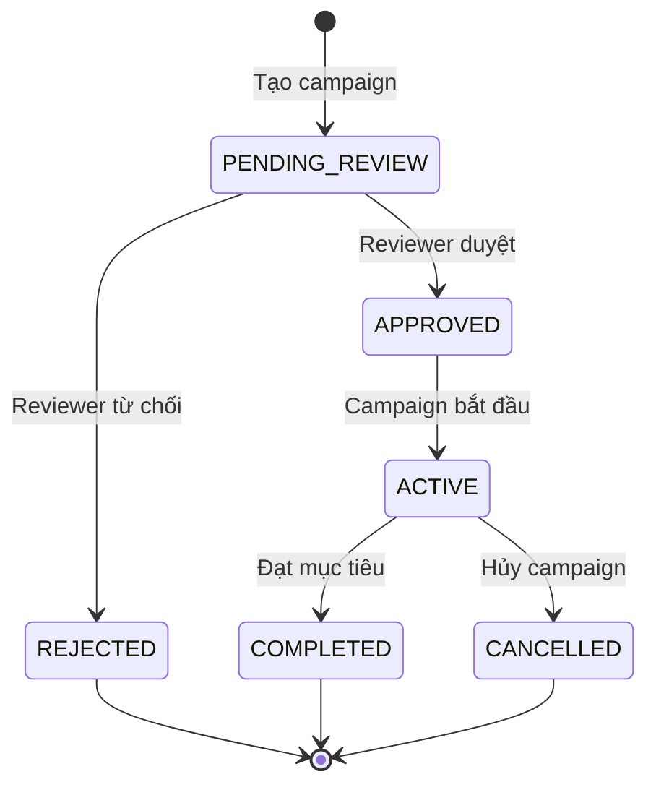

# 🎯 Campaigns Module - Hệ thống Chiến dịch Từ thiện

## 📋 Tổng quan

Module Campaigns quản lý toàn bộ vòng đời của các chiến dịch từ thiện, từ việc tạo, duyệt, đến quản lý donations và disbursements. Hệ thống hỗ trợ 2 loại chiến dịch và 2 loại funding model khác nhau.

## 🏗️ Kiến trúc Module

```
src/modules/campaigns/
├── dto/                         # Data Transfer Objects
│   ├── create-campaign.dto.ts   # DTO tạo chiến dịch
│   ├── update-campaign.dto.ts   # DTO cập nhật chiến dịch
│   ├── query-campaigns.dto.ts   # DTO query & filter
│   └── index.ts                 # Export DTOs
├── entities/                    # Database entities
│   └── campaign.entity.ts       # Campaign schema & interfaces
├── campaigns.controller.ts      # HTTP endpoints
├── campaigns.service.ts         # Business logic
└── campaigns.module.ts          # Module configuration
```

## 🔄 Campaign Types & Funding Models

### 📌 **Loại Chiến dịch (Campaign Types)**

#### 1. **Chiến dịch Thông thường (Normal)**

- Có thể chia nhiều giai đoạn (milestones)
- Thời gian thực hiện dài hạn
- Không yêu cầu uy tín đặc biệt
- Giải ngân theo từng milestone

#### 2. **Chiến dịch Khẩn cấp (Emergency)**

- **Yêu cầu uy tín ≥ 60 điểm**
- Chỉ 1 giai đoạn giải ngân
- Giải ngân nhanh sau khi được duyệt
- Được ưu tiên review

### 💰 **Mục tiêu Quyên góp (Funding Types)**

#### 1. **Fixed Funding**

- Phải đạt đủ 100% mục tiêu mới được giải ngân
- Nếu không đạt mục tiêu, hoàn lại toàn bộ tiền cho donors
- Phù hợp với các dự án có chi phí cố định

#### 2. **Flexible Funding**

- Có thể sử dụng số tiền đã quyên góp dù chưa đạt mục tiêu
- Cần điều chỉnh kế hoạch và xét duyệt lại nếu không đạt mục tiêu
- Phù hợp với các dự án có thể scale theo funding

## 🚦 Campaign Status Workflow



## 💻 API Endpoints

### 🔑 **Campaign Management**

#### **POST /campaigns**

Tạo chiến dịch mới

**Authentication:** Required  
**Body:**

```json
{
  "title": "Hỗ trợ học bổng cho trẻ em vùng sâu",
  "description": "Chiến dịch gây quỹ học bổng...",
  "type": "normal", // "normal" | "emergency"
  "fundingType": "flexible", // "fixed" | "flexible"
  "targetAmount": 50000000, // VNĐ
  "reviewFee": 100000, // VNĐ - phí duyệt
  "category": "Giáo dục",
  "tags": ["học bổng", "trẻ em", "giáo dục"],
  "startDate": "2024-01-15T00:00:00Z",
  "endDate": "2024-06-15T00:00:00Z",
  "milestones": [
    {
      "title": "Giai đoạn 1: Tuyển chọn học sinh",
      "description": "Khảo sát và tuyển chọn học sinh",
      "targetAmount": 20000000,
      "dueDate": "2024-03-15T00:00:00Z"
    }
  ]
}
```

**Response:**

```json
{
  "statusCode": 201,
  "message": "Chiến dịch đã được tạo thành công",
  "data": {
    "id": "64f8b9c123456789abcdef01",
    "title": "Hỗ trợ học bổng cho trẻ em vùng sâu",
    "status": "pending_review",
    "creatorId": "64f8b9c123456789abcdef02",
    "creatorName": "Nguyễn Văn A",
    "createdAt": "2024-01-01T10:00:00Z"
  }
}
```

#### **GET /campaigns**

Lấy danh sách chiến dịch với filter

**Query Parameters:**

- `page`: Số trang (default: 1)
- `limit`: Số items per page (default: 10, max: 100)
- `search`: Tìm kiếm theo title, description, creator
- `type`: "normal" | "emergency"
- `fundingType`: "fixed" | "flexible"
- `status`: Campaign status
- `category`: Lọc theo category
- `creatorId`: Lọc theo creator
- `isFeatured`: true/false
- `minTargetAmount`, `maxTargetAmount`: Range amount
- `sortBy`: "createdAt" | "targetAmount" | "currentAmount"
- `sortOrder`: "asc" | "desc"

**Response:**

```json
{
  "statusCode": 200,
  "message": "Lấy danh sách chiến dịch thành công",
  "data": [...],
  "pagination": {
    "current": 1,
    "pageSize": 10,
    "total": 150,
    "totalPages": 15
  }
}
```

#### **GET /campaigns/:id**

Lấy chi tiết chiến dịch

**Response:**

```json
{
  "statusCode": 200,
  "message": "Lấy chi tiết chiến dịch thành công",
  "data": {
    "id": "64f8b9c123456789abcdef01",
    "title": "Hỗ trợ học bổng cho trẻ em vùng sâu",
    "description": "...",
    "type": "normal",
    "fundingType": "flexible",
    "status": "active",
    "targetAmount": 50000000,
    "currentAmount": 25000000,
    "donorCount": 245,
    "reviewFee": 100000,
    "category": "Giáo dục",
    "tags": ["học bổng", "trẻ em"],
    "milestones": [...],
    "creatorId": {
      "id": "64f8b9c123456789abcdef02",
      "name": "Nguyễn Văn A",
      "reputation": 75
    },
    "viewCount": 1234,
    "shareCount": 56,
    "createdAt": "2024-01-01T10:00:00Z"
  }
}
```

#### **PATCH /campaigns/:id**

Cập nhật chiến dịch (chỉ creator hoặc admin)

**Authentication:** Required  
**Authorization:** Creator hoặc Admin

#### **DELETE /campaigns/:id**

Xóa chiến dịch (chỉ khi chưa có donation)

**Authentication:** Required  
**Authorization:** Creator hoặc Admin

### 🔍 **User-specific Endpoints**

#### **GET /campaigns/my-campaigns**

Lấy danh sách chiến dịch của tôi

**Authentication:** Required

#### **GET /campaigns/for-review**

Lấy danh sách chiến dịch cần duyệt (dành cho reviewer)

**Authentication:** Required  
**Authorization:** Reviewer hoặc Admin

### ✅ **Review Management**

#### **PUT /campaigns/:id/approve**

Duyệt chiến dịch

**Authentication:** Required  
**Authorization:** Reviewer hoặc Admin  
**Body:**

```json
{
  "comments": "Chiến dịch rất tốt, được duyệt"
}
```

#### **PUT /campaigns/:id/reject**

Từ chối chiến dịch

**Authentication:** Required  
**Authorization:** Reviewer hoặc Admin  
**Body:**

```json
{
  "reason": "Thiếu tài liệu chứng minh"
}
```

## 🔐 Business Rules & Validation

### 👤 **User Reputation Requirements**

- **Emergency Campaigns**: Yêu cầu reputation ≥ 60
- **Campaign Limits**:
  - Reputation < 60: Tối đa 2 campaigns đồng thời
  - Reputation 60-79: Tối đa 3 campaigns đồng thời
  - Reputation ≥ 80: Tối đa 5 campaigns đồng thời

### 💰 **Financial Validation**

- **Minimum Target**: 1,000 VNĐ
- **Maximum Target**: 10,000,000,000 VNĐ (10 tỷ)
- **Review Fee**: 0 - 1,000,000 VNĐ (1 triệu)
- **Milestone Total**: Phải bằng target amount

### 📋 **Campaign Rules**

- **Emergency Campaigns**: Chỉ 1 milestone
- **Normal Campaigns**: Không giới hạn milestones
- **Edit Restrictions**: Không edit được khi status = ACTIVE hoặc COMPLETED
- **Delete Restrictions**: Không xóa được nếu có donations

## 🎯 Review System

### 📊 **Review Priority**

Review fee quyết định độ ưu tiên:

- **≥ 500K VNĐ**: URGENT (Priority 4)
- **200K - 499K VNĐ**: HIGH (Priority 3)
- **50K - 199K VNĐ**: MEDIUM (Priority 2)
- **< 50K VNĐ**: LOW (Priority 1)

### 🔄 **Review Process**

1. Campaign được tạo → Status: PENDING_REVIEW
2. Reviewers lấy list campaigns theo priority (fee cao → thấp)
3. Reviewer duyệt/từ chối
4. Approved campaigns → Status: APPROVED
5. Creator có thể activate campaign

## 📊 Database Schema

### 🗄️ **Campaign Entity**

```typescript
interface Campaign {
  _id: ObjectId;
  title: string; // max 200 chars
  description: string; // max 5000 chars
  type: 'normal' | 'emergency';
  fundingType: 'fixed' | 'flexible';
  status: CampaignStatus;
  creatorId: ObjectId; // ref User
  creatorName: string;
  targetAmount: number; // VNĐ
  currentAmount: number; // VNĐ
  donorCount: number;
  reviewFee: number; // VNĐ
  category?: string;
  tags: string[];
  attachments: Attachment[];
  milestones: Milestone[];
  review?: Review;
  startDate?: Date;
  endDate?: Date;
  approvedAt?: Date;
  completedAt?: Date;
  rejectionReason?: string;
  isFollowing: boolean;
  isFeatured: boolean;
  viewCount: number;
  shareCount: number;
  image?: string;
  gallery: string[];
  blockchainTxHash?: string; // For blockchain integration
  smartContractAddress?: string;
  createdAt: Date;
  updatedAt: Date;
}
```

### 📋 **Supporting Interfaces**

```typescript
interface Milestone {
  title: string;
  description: string;
  targetAmount: number;
  dueDate: Date;
  status: 'pending' | 'in_progress' | 'completed';
  completedAt?: Date;
}

interface Attachment {
  fileName: string;
  fileUrl: string;
  fileType: string;
  fileSize: number;
  uploadedAt: Date;
}

interface Review {
  reviewerId: ObjectId;
  reviewerName: string;
  status: ReviewStatus;
  comments?: string;
  reviewedAt?: Date;
  priority: number;
}
```

## 🚀 Usage Examples

### 📝 **Tạo Normal Campaign**

```typescript
const normalCampaign = {
  title: 'Xây dựng thư viện cho trường tiểu học',
  description: 'Gây quỹ xây dựng thư viện...',
  type: 'normal',
  fundingType: 'fixed',
  targetAmount: 100000000, // 100 triệu
  reviewFee: 50000, // 50k
  category: 'Giáo dục',
  milestones: [
    {
      title: 'Giai đoạn 1: Xây dựng',
      description: 'Xây dựng phòng thư viện',
      targetAmount: 70000000,
      dueDate: '2024-06-15T00:00:00Z',
    },
    {
      title: 'Giai đoạn 2: Trang thiết bị',
      description: 'Mua sách và thiết bị',
      targetAmount: 30000000,
      dueDate: '2024-08-15T00:00:00Z',
    },
  ],
};
```

### 🚨 **Tạo Emergency Campaign**

```typescript
const emergencyCampaign = {
  title: 'Cứu trợ lũ lụt miền Trung',
  description: 'Hỗ trợ khẩn cấp cho người dân...',
  type: 'emergency', // Cần reputation ≥ 60
  fundingType: 'flexible',
  targetAmount: 500000000, // 500 triệu
  reviewFee: 1000000, // 1 triệu (priority cao)
  category: 'Thiên tai',
  // Không cần milestones - sẽ tự động tạo 1 milestone
};
```

## 🔗 Integration Points

### 🔗 **Module Dependencies**

- **Users Module**: User reputation, creator info
- **Auth Module**: JWT authentication
- **Shared Module**: File upload, utilities
- **Core Module**: Global filters, interceptors

### 📡 **Future Integrations**

- **Donations Module**: Process donations cho campaigns
- **Disbursement Module**: Giải ngân theo milestones
- **Blockchain Module**: Record transactions on blockchain
- **Notifications Module**: Notify về campaign updates

## 🧪 Testing

### 🔍 **Test Scenarios**

1. **Campaign Creation**
   - Normal user tạo normal campaign ✅
   - Low reputation user tạo emergency campaign ❌
   - User vượt quá giới hạn campaigns ❌

2. **Campaign Validation**
   - Milestone amounts không bằng target ❌
   - Invalid date ranges ❌
   - File upload validation ✅

3. **Review Process**
   - High fee campaigns được priority ✅
   - Review workflow đúng thứ tự ✅

4. **Authorization**
   - Chỉ creator/admin edit được ✅
   - Không delete khi có donations ❌

### 🏃‍♂️ **Running Tests**

```bash
# Unit tests
npm run test campaigns

# E2E tests
npm run test:e2e campaigns

# Test coverage
npm run test:cov
```

## 📈 Performance Considerations

### 🗂️ **Database Indexes**

```javascript
// MongoDB indexes for performance
db.campaigns.createIndex({ creatorId: 1 });
db.campaigns.createIndex({ status: 1 });
db.campaigns.createIndex({ type: 1 });
db.campaigns.createIndex({ category: 1 });
db.campaigns.createIndex({ createdAt: -1 });
db.campaigns.createIndex({ reviewFee: -1 }); // For review priority
```

### 🚀 **Optimization Tips**

- Use pagination cho list endpoints
- Cache popular campaigns
- Populate chỉ fields cần thiết
- Use lean() cho read-only queries

---

## 🔄 Next Steps

1. **File Upload Integration**: Implement actual file storage
2. **Statistics**: Campaign analytics dashboard
3. **Blockchain Integration**: Record campaigns on blockchain
4. **Advanced Search**: Full-text search với Elasticsearch
5. **Mobile API**: Optimize cho mobile apps

_Module này là foundation cho toàn bộ charity ecosystem! 🎉_
