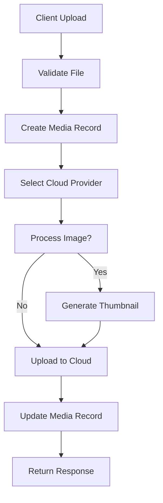

# 📸 Media Module Documentation

## 🎯 Overview

Media Module cung cấp API hoàn chỉnh để quản lý file media (hình ảnh, video, audio, tài liệu) với khả năng lưu trữ trên nhiều cloud provider khác nhau như Google Cloud Storage và Azure Blob Storage.

## 🏗️ Architecture

### 📁 Module Structure

```
src/modules/media/
├── entities/
│   └── media.entity.ts           # MongoDB schema definition
├── dto/
│   ├── upload-media.dto.ts       # Upload request validation
│   ├── media-response.dto.ts     # Response format
│   ├── query-media.dto.ts        # Query parameters
│   ├── update-media.dto.ts       # Update request validation
│   └── index.ts                  # Export barrel
├── media.controller.ts           # HTTP endpoints
├── media.service.ts              # Business logic
└── media.module.ts               # Module configuration
```

### 🔄 Service Dependencies

```
src/shared/services/
├── cloud-storage.interface.ts    # Cloud storage abstraction
├── google-cloud-storage.service.ts # Google Cloud implementation
├── azure-blob-storage.service.ts # Azure Blob implementation
└── media-processor.service.ts    # Image processing utilities
```

## 🚀 Features

### ✅ Core Features

- **Multi-Cloud Support**: Google Cloud Storage & Azure Blob Storage
- **File Type Support**: Images, Videos, Audio, Documents
- **Image Processing**: Automatic thumbnail generation, resizing, optimization
- **Security**: User-based access control, signed URLs
- **Metadata Tracking**: File information, usage statistics
- **Public/Private Files**: Flexible access control

### 📊 File Types Supported

| Type          | Extensions           | Max Size | Processing            |
| ------------- | -------------------- | -------- | --------------------- |
| **Images**    | jpeg, png, webp, gif | 10MB     | ✅ Thumbnails, Resize |
| **Videos**    | mp4, webm, ogg       | 100MB    | ❌ No processing      |
| **Audio**     | mp3, wav, ogg        | 50MB     | ❌ No processing      |
| **Documents** | pdf, txt, doc, docx  | 10MB     | ❌ No processing      |

## 🔌 API Endpoints

### 📤 Upload Media

```http
POST /media/upload
Content-Type: multipart/form-data
Authorization: Bearer <token>

# Form Data:
file: <file>
type: image|video|audio|document
tags: ["tag1", "tag2"] (optional)
description: "File description" (optional)
altText: "Alt text for accessibility" (optional)
isPublic: true|false (optional)
provider: google_cloud|azure_blob (optional)
```

**Response:**

```json
{
  "id": "64f8b1234567890abcdef123",
  "originalName": "profile-picture.jpg",
  "filename": "64f8b1234567890abcdef123_profile-picture.jpg",
  "mimetype": "image/jpeg",
  "size": 1024000,
  "type": "image",
  "provider": "google_cloud",
  "url": "https://storage.googleapis.com/bucket/path/file.jpg",
  "thumbnailUrl": "https://storage.googleapis.com/bucket/path/thumb_file.jpg",
  "status": "ready",
  "metadata": {
    "width": 1920,
    "height": 1080,
    "format": "JPEG"
  },
  "tags": ["profile", "avatar"],
  "isPublic": false,
  "downloadCount": 0,
  "viewCount": 1,
  "createdAt": "2024-01-15T10:30:00.000Z"
}
```

### 📋 Get Media List

```http
GET /media?page=1&limit=20&type=image&search=profile
Authorization: Bearer <token>
```

**Query Parameters:**

- `page`: Page number (default: 1)
- `limit`: Items per page (default: 20, max: 100)
- `type`: Filter by media type
- `provider`: Filter by cloud provider
- `status`: Filter by processing status
- `search`: Search in filename/description
- `tags`: Comma-separated tags filter
- `isPublic`: Filter by public/private
- `sortBy`: Sort field (createdAt, size, downloadCount, viewCount)
- `sortOrder`: Sort direction (asc, desc)

### 🔍 Get Media by ID

```http
GET /media/:id
Authorization: Bearer <token>
```

### 📝 Update Media

```http
PUT /media/:id
Authorization: Bearer <token>

{
  "tags": ["updated", "tag"],
  "description": "Updated description",
  "altText": "Updated alt text",
  "isPublic": true
}
```

### 🗑️ Delete Media

```http
DELETE /media/:id
Authorization: Bearer <token>
```

### ⬇️ Download Media

```http
GET /media/:id/download?expires=3600
Authorization: Bearer <token>
```

**Response:**

```json
{
  "downloadUrl": "https://storage.googleapis.com/bucket/path/file.jpg?signature=..."
}
```

### 👁️ View Media (Redirect)

```http
GET /media/:id/view
Authorization: Bearer <token>
```

Returns 302 redirect to actual file URL.

### 🌐 Public Endpoints

All endpoints have public equivalents (no authentication required):

- `GET /media/public` - Public media list
- `GET /media/public/:id` - Public media details
- `GET /media/public/:id/download` - Public download
- `GET /media/public/:id/view` - Public view

## 🔧 Configuration

### Environment Variables

```bash
# Default cloud provider
DEFAULT_CLOUD_PROVIDER=google_cloud

# Google Cloud Storage
GCS_PROJECT_ID=your-project-id
GCS_BUCKET_NAME=your-bucket-name
GCS_KEY_FILE=./path/to/service-account-key.json

# Azure Blob Storage
AZURE_STORAGE_ACCOUNT=your-storage-account
AZURE_STORAGE_KEY=your-storage-key
AZURE_CONTAINER_NAME=your-container-name

# File size limits (bytes)
MAX_IMAGE_SIZE=10485760    # 10MB
MAX_VIDEO_SIZE=104857600   # 100MB
MAX_AUDIO_SIZE=52428800    # 50MB
MAX_DOCUMENT_SIZE=10485760 # 10MB
```

## 🏛️ Database Schema

### Media Entity

```typescript
{
  userId: ObjectId,           // Owner of the media
  originalName: string,       // Original filename
  filename: string,           // Generated filename
  mimetype: string,          // MIME type
  size: number,              // File size in bytes
  type: MediaType,           // image|video|audio|document
  provider: MediaProvider,   // google_cloud|azure_blob
  url: string,               // Public URL
  cloudPath: string,         // Path in cloud storage
  status: MediaStatus,       // uploading|processing|ready|failed|deleted
  thumbnailUrl?: string,     // Thumbnail URL (images only)
  metadata?: {               // File metadata
    width?: number,
    height?: number,
    duration?: number,
    format?: string,
    quality?: string
  },
  tags: string[],            // Categorization tags
  isPublic: boolean,         // Public access flag
  description?: string,      // File description
  altText?: string,          // Accessibility text
  downloadCount: number,     // Download statistics
  viewCount: number,         // View statistics
  uploadedAt: Date,          // Upload timestamp
  processedAt?: Date,        // Processing completion
  createdAt: Date,           // Creation timestamp
  updatedAt: Date            // Last update timestamp
}
```

### Indexes

```javascript
// Performance indexes
{ userId: 1, status: 1 }
{ provider: 1, cloudPath: 1 }
{ type: 1, status: 1 }
{ createdAt: -1 }
{ tags: 1 }
{ isPublic: 1, status: 1 }
```

## 🔄 Processing Flow

### 1. Upload Process



### 2. Image Processing

For image files:

1. **Validation**: Check if file is valid image
2. **Metadata Extraction**: Get width, height, format
3. **Thumbnail Generation**: Create 300x300 JPEG thumbnail
4. **Upload**: Upload original and thumbnail to cloud
5. **Update Status**: Mark as ready

### 3. File Organization

Files are organized in cloud storage as:

```
media/
├── google_cloud/
│   ├── images/
│   │   └── 2024/
│   │       └── 01/
│   │           └── 15/
│   │               └── 64f8b1234567890abcdef123_profile.jpg
│   ├── videos/
│   ├── audio/
│   └── documents/
└── azure_blob/
    └── [same structure]
```

## 🛡️ Security Features

### 1. Access Control

- **User-based**: Users can only access their own files
- **Public Files**: Files marked as public are accessible to everyone
- **Authentication**: JWT token required for private endpoints

### 2. File Validation

- **Size Limits**: Configurable per file type
- **MIME Type**: Strict validation against allowed types
- **Image Validation**: Sharp library validation for images

### 3. Signed URLs

- **Temporary Access**: Download URLs expire after specified time
- **No Direct Access**: Cloud storage URLs are not directly accessible
- **Secure Downloads**: All downloads go through signed URL generation

## 🚀 Usage Examples

### Frontend Integration

```typescript
// Upload file
const uploadFile = async (file: File, type: MediaType) => {
  const formData = new FormData();
  formData.append('file', file);
  formData.append('type', type);
  formData.append('isPublic', 'false');
  formData.append('tags', JSON.stringify(['profile', 'avatar']));

  const response = await fetch('/api/media/upload', {
    method: 'POST',
    headers: {
      Authorization: `Bearer ${token}`,
    },
    body: formData,
  });

  return response.json();
};

// Get media list
const getMediaList = async (page = 1, filters = {}) => {
  const params = new URLSearchParams({
    page: page.toString(),
    ...filters,
  });

  const response = await fetch(`/api/media?${params}`, {
    headers: {
      Authorization: `Bearer ${token}`,
    },
  });

  return response.json();
};

// Get download URL
const getDownloadUrl = async (mediaId: string) => {
  const response = await fetch(`/api/media/${mediaId}/download`, {
    headers: {
      Authorization: `Bearer ${token}`,
    },
  });

  const { downloadUrl } = await response.json();
  return downloadUrl;
};
```

### Backend Integration

```typescript
// In another service
import { MediaService } from '@modules/media/media.service';

@Injectable()
export class UserService {
  constructor(private mediaService: MediaService) {}

  async updateUserAvatar(userId: string, file: Express.Multer.File) {
    // Upload avatar
    const media = await this.mediaService.uploadFile(userId, file, {
      type: MediaType.IMAGE,
      tags: ['avatar', 'profile'],
      isPublic: true,
    });

    // Update user record with media ID
    await this.userModel.findByIdAndUpdate(userId, {
      avatar: media.url,
      avatarMediaId: media._id,
    });

    return media;
  }
}
```

## 🔧 Customization

### Adding New Cloud Provider

1. **Implement Interface**:

```typescript
export class NewCloudService implements CloudStorageService {
  async uploadFile(
    file: Express.Multer.File,
    path: string,
    options?: UploadOptions,
  ): Promise<UploadResult> {
    // Implementation
  }
  // ... other methods
}
```

2. **Update MediaService**:

```typescript
private getCloudService(provider: MediaProvider) {
  switch (provider) {
    case MediaProvider.NEW_CLOUD:
      return this.newCloudService;
    // ... existing cases
  }
}
```

3. **Add to Module**:

```typescript
@Module({
  providers: [
    // ... existing providers
    NewCloudService,
  ],
})
export class MediaModule {}
```

### Custom File Processing

```typescript
// Add custom processing in MediaService.uploadFile
if (uploadDto.type === MediaType.IMAGE) {
  // Custom image processing
  const customProcessedBuffer = await this.customImageProcessor.process(
    file.buffer,
  );
  processedBuffer = customProcessedBuffer;
}
```

## 📊 Monitoring & Analytics

### Built-in Metrics

- **Upload Success Rate**: Track failed uploads
- **Processing Time**: Monitor image processing performance
- **Storage Usage**: Track cloud storage consumption
- **Download Patterns**: Analyze file access patterns

### Logging

All operations are logged with appropriate levels:

- **INFO**: Successful operations
- **WARN**: Non-critical issues
- **ERROR**: Failed operations with stack traces

## 🐛 Troubleshooting

### Common Issues

1. **Upload Fails**
   - Check file size limits
   - Verify MIME type is allowed
   - Ensure cloud storage credentials are correct

2. **Image Processing Fails**
   - Verify Sharp library installation
   - Check image file integrity
   - Ensure sufficient memory for processing

3. **Cloud Storage Issues**
   - Verify bucket/container permissions
   - Check network connectivity
   - Validate service account credentials

4. **Authentication Errors**
   - Ensure JWT token is valid
   - Check user permissions
   - Verify token expiration

## 🚀 Future Enhancements

- **Video Processing**: Thumbnail generation for videos
- **Audio Processing**: Waveform generation
- **CDN Integration**: CloudFront/CloudFlare support
- **Batch Operations**: Bulk upload/delete
- **Advanced Search**: Full-text search capabilities
- **Virus Scanning**: Security scanning for uploaded files
- **Compression**: Advanced compression algorithms
- **Watermarking**: Automatic watermark application

---

_Media Module được thiết kế để scale và dễ dàng mở rộng cho các nhu cầu tương lai! 🎯_


